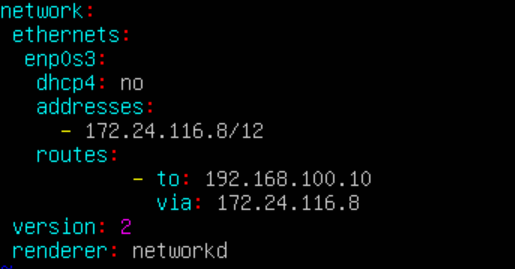
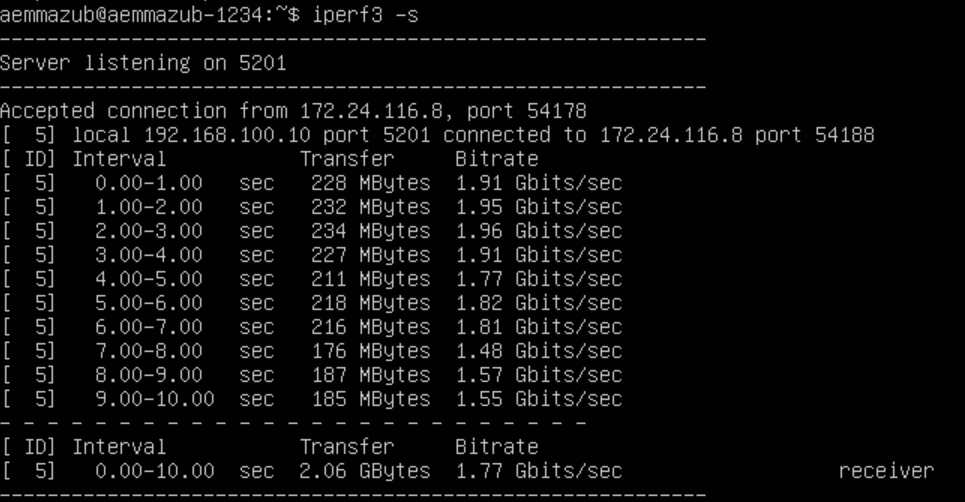
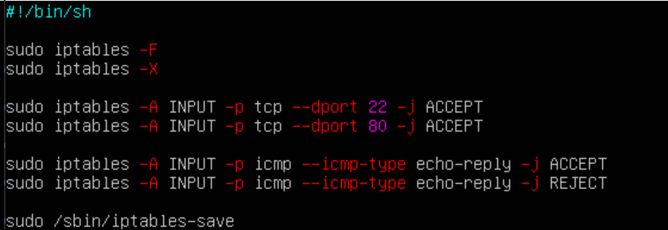
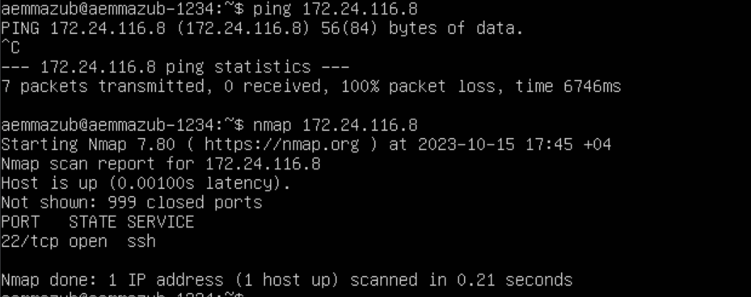
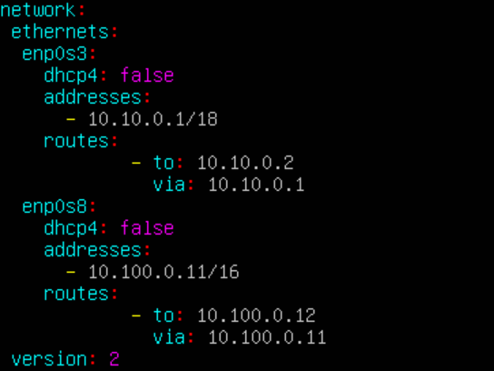
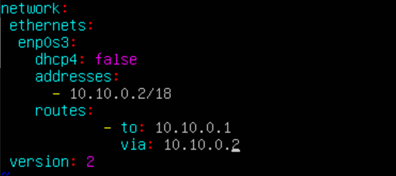
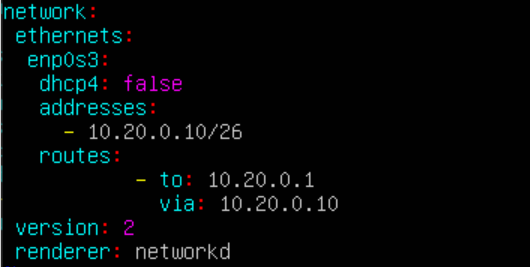
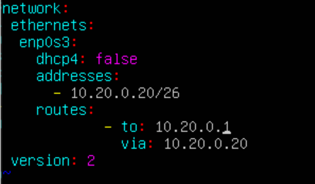

# Сети в Linux

Настройка сетей в Linux на виртуальных машинах.


## Contents

1. [Chapter I](#chapter-iii) \
   1.1. [Инструмент ipcalc](#part-1-инструмент-ipcalc) \
   1.2. [Статическая маршрутизация между двумя машинами](#part-2-статическая-маршрутизация-между-двумя-машинами) \
   1.3. [Утилита iperf3](#part-3-утилита-iperf3) \
   1.4. [Сетевой экран](#part-4-сетевой-экран) \
   1.5. [Статическая маршрутизация сети](#part-5-статическая-маршрутизация-сети) \
   1.6. [Динамическая настройка IP с помощью DHCP](#part-6-динамическая-настройка-ip-с-помощью-dhcp) \
   1.7. [NAT](#part-7-nat) \
   1.8. [Знакомство с SSH Tunnels](#part-8-знакомство-с-ssh-tunnels)

## Part 1. Инструмент **ipcalc**

#### 1.1. Сети и маски
##### Определить и записать в отчёт:
1) Адрес сети 192.167.38.54/13
 
2) перевод маски *255.255.255.0* в префиксную и двоичную запись, */15* в обычную и двоичную, *11111111.11111111.11111111.11110000* в обычную и префиксную


3) минимальный и максимальный хост в сети *12.167.38.4* при масках: */8*, *11111111.11111111.00000000.00000000*, *255.255.254.0* и */4*
   
  
  
  
   

#### 1.2. localhost
##### Определить и записать в отчёт, можно ли обратиться к приложению, работающему на localhost, со следующими IP: *194.34.23.100*, *127.0.0.2*, *127.1.0.1*, *128.0.0.1*
* Адреса, которые могут быть:
  127.1.0.1;    
  127.0.0.2. 

#### 1.3. Диапазоны и сегменты сетей
##### Определить и записать в отчёт:
##### 1) какие из перечисленных IP можно использовать в качестве публичного, а какие только в качестве частных: *10.0.0.45*, *134.43.0.2*, *192.168.4.2*, *172.20.250.4*, *172.0.2.1*, *192.172.0.1*, *172.68.0.2*, *172.16.255.255*, *10.10.10.10*, *192.169.168.1*
1. 10.0.0.45/8 - Частный
2. 134.43.0.2/16 - Публичный
3. 192.168.4.2/16 - Частный
4. 172.20.250.4/12 - Частный
5. 172.0.2.1/12 - Публичный
6. 192.172.0.1/12 - Публичный
7. 172.68.0.2/12 - Публичный
8. 172.16.255.255/12 - Частный
9. 10.10.10.10/8 - Частный
10. 192.169.168.1/16 - Публичный
##### 2) какие из перечисленных IP адресов шлюза возможны у сети *10.10.0.0/18*: *10.0.0.1*, *10.10.0.2*, *10.10.10.10*, *10.10.100.1*, *10.10.1.255*

1. 10.10.0.2
2. 10.10.10.10
3. 10.10.1.255

## Part 2. Статическая маршрутизация между двумя машинами

##### Поднять две виртуальные машины (далее -- ws1 и ws2)

##### С помощью команды `ip a` посмотреть существующие сетевые интерфейсы
WS-1:

WS-2:

##### Описать сетевой интерфейс, соответствующий внутренней сети, на обеих машинах и задать следующие адреса и маски: ws1 - *192.168.100.10*, маска */16*, ws2 - *172.24.116.8*, маска */12*

##### Выполнить команду `netplan apply` для перезапуска сервиса сети


WS-1:

WS-2:


#### 2.1. Добавление статического маршрута вручную
##### Добавить статический маршрут от одной машины до другой и обратно при помощи команды вида `ip r add`
* WS-1:

* WS-2:

##### Пропинговать соединение между машинами
* С WS-1 пингую WS-2:

* С WS-2 пингую WS-1:


#### 2.2. Добавление статического маршрута с сохранением
##### Перезапустить машины
##### Добавить статический маршрут от одной машины до другой с помощью файла *etc/netplan/00-installer-config.yaml*
* WS-1:

* WS-2:

##### Пропинговать соединение между машинами
* WS-1:

* WS-2:


## Part 3. Утилита **iperf3**

#### 3.1. Скорость соединения
##### Перевести и записать в отчёт: 8 Mbps в MB/s, 100 MB/s в Kbps, 1 Gbps в Mbps
1) 8 Mbps = 1 MS/s.
2) 100 MB.s = 100000 Kbps.
3) 1 Gbps = 1000 Mbps.
#### 3.2. Утилита **iperf3**
##### Измерить скорость соединения между ws1 и ws2
iperf3 -c "ip-address reciver" - чтобы отправить пакеты для проверки скорости
WS-1:

WS-2:


## Part 4. Сетевой экран

#### 4.1. Утилита **iptables**
##### Создать файл */etc/firewall.sh*, имитирующий фаерволл, на ws1 и ws2:
```shell
#!/bin/sh

# Удаление всех правил в таблице "filter" (по-умолчанию).
iptables –F
iptables -X
```
##### Нужно добавить в файл подряд следующие правила:
##### 1) на ws1 применить стратегию когда в начале пишется запрещающее правило, а в конце пишется разрешающее правило (это касается пунктов 4 и 5)
##### 2) на ws2 применить стратегию когда в начале пишется разрешающее правило, а в конце пишется запрещающее правило (это касается пунктов 4 и 5)
##### 3) открыть на машинах доступ для порта 22 (ssh) и порта 80 (http)
##### 4) запретить *echo reply* (машина не должна "пинговаться”, т.е. должна быть блокировка на OUTPUT)
##### 5) разрешить *echo reply* (машина должна "пинговаться")
* Содержание файлов firewall.sh
  * WS-1:

  * WS-2:

##### Запустить файлы на обеих машинах командами `chmod +x /etc/firewall.sh` и `/etc/firewall.sh`

* Запуск скриптов:
  * WS-1:
 
  * WS-2:
  

* Разница в стратегиях заключается в том, что изначально в машине ws-1 мы сначала разрешаем, а после запрещаем вывод ping'a. В машине ws2 всё ровным счетом наоборот.

#### 4.2. Утилита **nmap**
##### Командой **ping** найти машину, которая не "пингуется", после чего утилитой **nmap** показать, что хост машины запущен
* Пробуем пингануть и пользуемся nmap, чтобы убедиться, что вторая машина включена


## Part 5. Статическая маршрутизация сети

##### Поднять пять виртуальных машин (3 рабочие станции (ws11, ws21, ws22) и 2 роутера (r1, r2))

#### 5.1. Настройка адресов машин
##### Настроить конфигурации машин в *etc/netplan/00-installer-config.yaml* согласно сети на рисунке.
 
* Собранная топология, конфиги устройств
  * R1:
 
  * R2:

  * WS11:

  * WS21:

  * WS22:

##### Перезапустить сервис сети. Если ошибок нет, то командой `ip -4 a` проверить, что адрес машины задан верно. Также пропинговать ws22 с ws21. Аналогично пропинговать r1 с ws11.
* ip -4 a для машин:
  * R1:

  * R2:

  * WS11:

  * WS21:

  * WS22:

#### 5.2. Включение переадресации IP-адресов.
##### Для включения переадресации IP, выполнил команду на роутерах:
* `sysctl -w net.ipv4.ip_forward=1`

  
##### Откройте файл */etc/sysctl.conf* и добавьте в него следующую строку:
* `net.ipv4.ip_forward = 1 (Важно перегружать службу)
  

#### 5.3. Установка маршрута по-умолчанию

##### Настроить маршрут по-умолчанию (шлюз) для рабочих станций. Для этого добавить `default` перед IP роутера в файле конфигураций
* ws11:
  
* ws21:
   
* ws22:
  
##### Вызвать `ip r` и показать, что добавился маршрут в таблицу маршрутизации
* ws11:
  
* ws21:
  
* ws22:
  

##### Пропинговать с ws11 роутер r2 и показать на r2, что пинг доходит. Для этого использовать команду:
* Пинганул с ws11 до r2, запустил на r `tcpdump -tn -i eth1`


#### 5.4. Добавление статических маршрутов
* Добавил статические маршруты в сеть:
  * r-1:

  * r-2:


* Вызвал `ip r` на обоих роутерах.
  * r-1

  * r-2:


* Запустил команды на ws11:
  * `ip r list 10.10.0.0/18` и `ip r list 0.0.0.0/0`
  


* В первом случае мы смотрим на путь до сети в которой ws11 уже находится и поэтому выводится просто что мы в ней и она доступна по интерфейсу enp0s3, во втором случае мы запрашиваем список адресов по умолчанию(gateway) 

#### 5.5. Построение списка маршрутизаторов

* Запустил на r1 команду дампа:
`tcpdump -tnv -i enp0s3`

* traceroute:


* Путь строиться от узла к узлу до того момента, пока не будет достигнута конечная точка. Каждый пакет проходит на своем пути определенное количество узлов, пока достигнет своей цели. На каждом узле добавляется счетчик, который отслеживает количество пройденых узлов.

#### 5.6. Использование протокола **ICMP** при маршрутизации

* `ping -c 1 10.30.0.111` на ws-11:

* tcpdump на r1:


## Part 6. Динамическая настройка IP с помощью **DHCP**

* Для r2 настроил в файле */etc/dhcp/dhcpd.conf* конфигурацию службы DHCP: указал адрес маршрутизатора по-умолчанию, DNS-сервер и адрес внутренней сети. 
  
* в файле *resolv.conf* прописать `nameserver 8.8.8.8.`
  
* Перезагрузил службу **DHCP** командой `systemctl restart isc-dhcp-server`. 
    
* Машину ws21 перезагрузил при помощи `reboot` и через `ip a` показал, что она получила адрес. 
     
* Пропинговал ws22 с ws21.
       

* Указал MAC адрес у ws11 `macaddress: 10:10:10:10:10:BA`(на виртуалке тоже необходимо это делать) и установил `dhcp4: true`
         

* Настройка r1 по аналогии с r2:
           
* Назначенный ip-адрес на ws11:
           
##### Запросить с ws21 обновление ip адреса
* До:
  
* Вызов команды для смены ip:
    
* После применения команды и перезагрузки:
    

* Использовал команду `dhcpclient -r -v enp0s3`
Стерли предыдущий ip, назначили новый на интерфейс enp0s3

## Part 7. **NAT**
* В файле */etc/apache2/ports.conf* на ws22 и r1 измениk строку `Listen 80` на `Listen 0.0.0.0:80`

* Запустить веб-сервер Apache командой `service apache2 start` на ws22 и r1


* Добавил в фаервол, созданный по аналогии с фаерволом из Части 4, на r2 следующие правила:
  * Удаление правил в таблице filter - `iptables -F`
  * Удаление правил в таблице "NAT" - `iptables -F -t nat`
  * Отбрасывать все маршрутизируемые пакеты - `iptables --policy FORWARD DROP`

 
* Добавил в файл ещё одно правило:
  * Разрешил маршрутизацию всех пакетов протокола **ICMP**. Проверил  соединение между ws22 и r1 командой `ping`


* Итоговый файл по пути /etc/firewall.sh
  
* Запустил скрипт firewall.sh
  
* Проверил соединение по TCP для **SNAT**, для этого с ws22 подключил к серверу Apache на r1 командой:

* Проверить соединение по TCP для **DNAT**, для этого с r1 подключил к серверу Apache на ws22 командой `telnet      обращаться по адресу r2 и порту 8080

